# 🏗️ Arquitetura Técnica - FIAP Cloud Games Platform

## 📋 Índice
- [🏗️ Arquitetura Técnica - FIAP Cloud Games Platform](#️-arquitetura-técnica---fiap-cloud-games-platform)
  - [📋 Índice](#-índice)
  - [🎯 Visão Geral da Plataforma](#-visão-geral-da-plataforma)
  - [🏛️ Arquitetura de Microsserviços](#️-arquitetura-de-microsserviços)
    - [🔧 Visão Geral dos Serviços](#-visão-geral-dos-serviços)
    - [📡 Comunicação entre Microsserviços](#-comunicação-entre-microsserviços)
  - [🔐 Identity Service - Autenticação e Autorização](#-identity-service---autenticação-e-autorização)
    - [🚪 Processo de Login](#-processo-de-login)
    - [🛡️ Segurança e Rate Limiting](#️-segurança-e-rate-limiting)
  - [🎮 Games Catalog Service](#-games-catalog-service)
    - [🔍 Busca e Recomendações com Elasticsearch](#-busca-e-recomendações-com-elasticsearch)
    - [📚 Gerenciamento de Biblioteca de Usuário](#-gerenciamento-de-biblioteca-de-usuário)
  - [💳 Payment Service](#-payment-service)
    - [💰 Gestão de Carteira](#-gestão-de-carteira)
    - [🔄 CQRS e Event Sourcing](#-cqrs-e-event-sourcing)
  - [🛒 Fluxo Completo de Compra](#-fluxo-completo-de-compra)
  - [🔙 Fluxo Completo de Reembolso](#-fluxo-completo-de-reembolso)
  - [📊 Monitoramento e Observabilidade](#-monitoramento-e-observabilidade)
    - [📈 Observability Stack](#-observability-stack)
    - [🔍 Telemetry Flow & Correlation](#-telemetry-flow--correlation)
    - [📊 OpenTelemetry Configuration](#-opentelemetry-configuration)
  - [🗄️ Modelo de Dados](#️-modelo-de-dados)
    - [💾 Identity Service Database](#-identity-service-database)
    - [🎲 Games Catalog Database](#-games-catalog-database)
    - [💵 Payment Service Database](#-payment-service-database)
  - [☁️ Infraestrutura AWS](#️-infraestrutura-aws)
    - [🎯 Componentes AWS](#-componentes-aws)
    - [⚙️ Event-Driven Architecture](#️-event-driven-architecture)
  - [⚙️ Especificações Técnicas](#️-especificações-técnicas)
    - [🏷️ Versões e Dependências](#️-versões-e-dependências)
    - [📊 Performance Specifications](#-performance-specifications)

---

## 🎯 Visão Geral da Plataforma

A **FIAP Cloud Games Platform** é uma plataforma distribuída de jogos digitais composta por três microsserviços principais: **Identity**, **Games Catalog** e **Payment**. A arquitetura segue princípios de **Clean Architecture**, **Domain-Driven Design (DDD)**, **CQRS** e **Event Sourcing**, deployada em **AWS EKS** com **Kong Ingress Controller**.

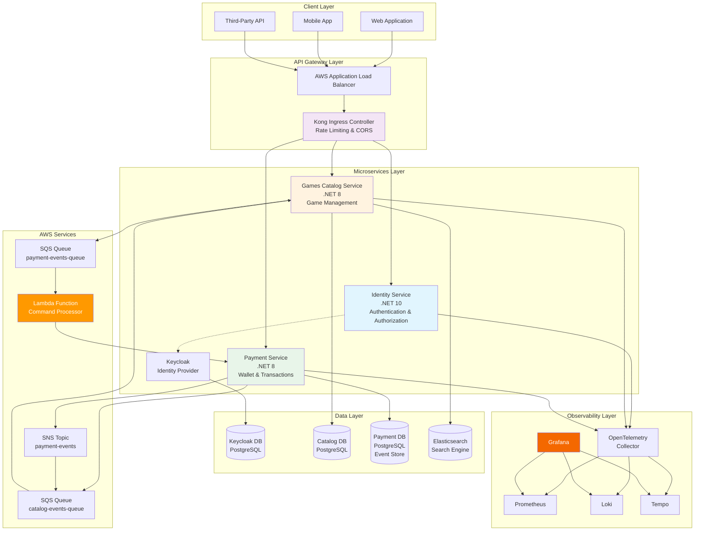
```mermaid
graph TB
    subgraph "Client Layer"
        WEB[Web Application]
        MOB[Mobile App]
        API_CLIENT[Third-Party API]
    end

    subgraph "API Gateway Layer"
        ALB[AWS Application Load Balancer]
        KONG[Kong Ingress Controller<br/>Rate Limiting & CORS]
    end

    subgraph "Microservices Layer"
        IDENTITY[Identity Service<br/>.NET 10<br/>Authentication & Authorization]
        CATALOG[Games Catalog Service<br/>.NET 8<br/>Game Management]
        PAYMENT[Payment Service<br/>.NET 8<br/>Wallet & Transactions]
        KC[Keycloak<br/>Identity Provider]
    end

    subgraph "Data Layer"
        KCDB[(Keycloak DB<br/>PostgreSQL)]
        CATALOGDB[(Catalog DB<br/>PostgreSQL)]
        PAYMENTDB[(Payment DB<br/>PostgreSQL<br/>Event Store)]
        ELASTIC[(Elasticsearch<br/>Search Engine)]
    end

    subgraph "AWS Services"
        SQS1[SQS Queue<br/>payment-events-queue]
        SQS2[SQS Queue<br/>catalog-events-queue]
        SNS[SNS Topic<br/>payment-events]
        LAMBDA[Lambda Function<br/>Command Processor]
    end

    subgraph "Observability Layer"
        PROM[Prometheus]
        LOKI[Loki]
        TEMPO[Tempo]
        GRAFANA[Grafana]
        OTEL[OpenTelemetry<br/>Collector]
    end

    WEB --> ALB
    MOB --> ALB
    API_CLIENT --> ALB
    ALB --> KONG
    KONG --> IDENTITY
    KONG --> CATALOG
    KONG --> PAYMENT
    IDENTITY -.-> KC
    KC --> KCDB
    CATALOG --> CATALOGDB
    CATALOG --> ELASTIC
    PAYMENT --> PAYMENTDB
    CATALOG --> SQS1
    PAYMENT --> SQS2
    PAYMENT --> SNS
    SQS1 --> LAMBDA
    LAMBDA --> PAYMENT
    SNS --> SQS2
    SQS2 --> CATALOG
    
    IDENTITY --> OTEL
    CATALOG --> OTEL
    PAYMENT --> OTEL
    OTEL --> PROM
    OTEL --> LOKI
    OTEL --> TEMPO
    GRAFANA --> PROM
    GRAFANA --> LOKI
    GRAFANA --> TEMPO
    
    style IDENTITY fill:#e1f5fe
    style CATALOG fill:#fff3e0
    style PAYMENT fill:#e8f5e9
    style KONG fill:#f3e5f5
    style GRAFANA fill:#f46800,color:#fff
    style LAMBDA fill:#ff9900,color:#fff
```

---

## 🏛️ Arquitetura de Microsserviços

### 🔧 Visão Geral dos Serviços

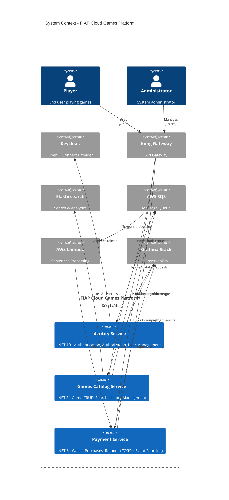
```mermaid
C4Context
    title System Context - FIAP Cloud Games Platform

    Person(user, "Player", "End user playing games")
    Person(admin, "Administrator", "System administrator")
    
    System_Boundary(platform, "FIAP Cloud Games Platform") {
        System(identity, "Identity Service", ".NET 10 - Authentication, Authorization, User Management")
        System(catalog, "Games Catalog Service", ".NET 8 - Game CRUD, Search, Library Management")
        System(payment, "Payment Service", ".NET 8 - Wallet, Purchases, Refunds (CQRS + Event Sourcing)")
    }
    
    System_Ext(keycloak, "Keycloak", "OpenID Connect Provider")
    System_Ext(kong, "Kong Gateway", "API Gateway")
    System_Ext(elasticsearch, "Elasticsearch", "Search & Analytics")
    System_Ext(aws_sqs, "AWS SQS", "Message Queue")
    System_Ext(aws_lambda, "AWS Lambda", "Serverless Processing")
    System_Ext(grafana, "Grafana Stack", "Observability")
    
    Rel(user, kong, "Uses", "HTTPS")
    Rel(admin, kong, "Manages", "HTTPS")
    Rel(kong, identity, "Routes auth requests")
    Rel(kong, catalog, "Routes catalog requests")
    Rel(kong, payment, "Routes payment requests")
    Rel(identity, keycloak, "Validates tokens")
    Rel(catalog, elasticsearch, "Indexes & searches")
    Rel(catalog, aws_sqs, "Publishes purchase events")
    Rel(payment, aws_sqs, "Publishes payment events")
    Rel(aws_sqs, aws_lambda, "Triggers processing")
    Rel(aws_lambda, payment, "Processes commands")
    Rel(identity, grafana, "Exports telemetry")
    Rel(catalog, grafana, "Exports telemetry")
    Rel(payment, grafana, "Exports telemetry")
```

### 📡 Comunicação entre Microsserviços

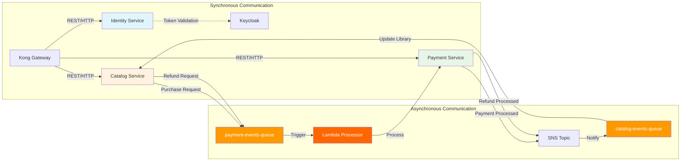
```mermaid
graph LR
    subgraph "Synchronous Communication"
        API[Kong Gateway] -->|REST/HTTP| IDENTITY[Identity Service]
        API -->|REST/HTTP| CATALOG[Catalog Service]
        API -->|REST/HTTP| PAYMENT[Payment Service]
        IDENTITY -.->|Token Validation| KC[Keycloak]
    end
    
    subgraph "Asynchronous Communication"
        CATALOG -->|Purchase Request| SQS1[payment-events-queue]
        SQS1 -->|Trigger| LAMBDA[Lambda Processor]
        LAMBDA -->|Process| PAYMENT
        PAYMENT -->|Payment Processed| SNS[SNS Topic]
        SNS -->|Notify| SQS2[catalog-events-queue]
        SQS2 -->|Update Library| CATALOG
        CATALOG -->|Refund Request| SQS1
        PAYMENT -->|Refund Processed| SNS
    end
    
    style IDENTITY fill:#e1f5fe
    style CATALOG fill:#fff3e0
    style PAYMENT fill:#e8f5e9
    style SQS1 fill:#ff9900,color:#fff
    style SQS2 fill:#ff9900,color:#fff
    style LAMBDA fill:#ff6600,color:#fff
```

---

## 🔐 Identity Service - Autenticação e Autorização

### 🚪 Processo de Login

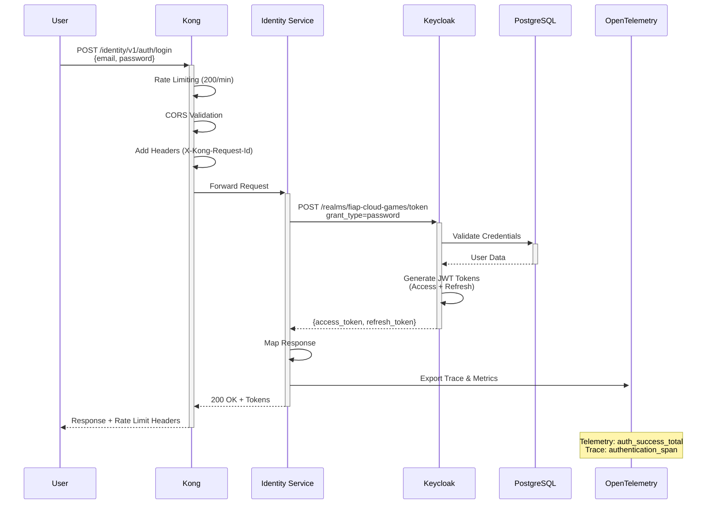
```mermaid
sequenceDiagram
    participant User
    participant Kong
    participant Identity as Identity Service
    participant KC as Keycloak
    participant DB as PostgreSQL
    participant OTEL as OpenTelemetry

    User->>+Kong: POST /identity/v1/auth/login<br/>{email, password}
    Kong->>Kong: Rate Limiting (200/min)
    Kong->>Kong: CORS Validation
    Kong->>Kong: Add Headers (X-Kong-Request-Id)
    Kong->>+Identity: Forward Request
    
    Identity->>+KC: POST /realms/fiap-cloud-games/token<br/>grant_type=password
    KC->>+DB: Validate Credentials
    DB-->>-KC: User Data
    KC->>KC: Generate JWT Tokens<br/>(Access + Refresh)
    KC-->>-Identity: {access_token, refresh_token}
    
    Identity->>Identity: Map Response
    Identity->>+OTEL: Export Trace & Metrics
    
    Identity-->>-Kong: 200 OK + Tokens
    Kong-->>-User: Response + Rate Limit Headers
    
    Note over OTEL: Telemetry: auth_success_total<br/>Trace: authentication_span
```

### 🛡️ Segurança e Rate Limiting

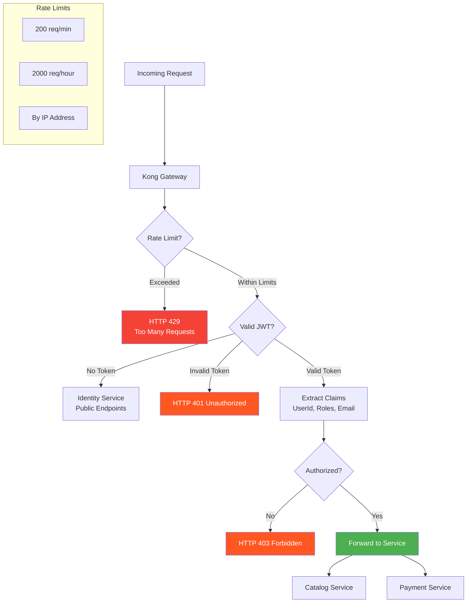
```mermaid
flowchart TD
    REQUEST[Incoming Request] --> KONG[Kong Gateway]
    KONG --> RL_CHECK{Rate Limit?}
    
    RL_CHECK -->|Exceeded| DENY[HTTP 429<br/>Too Many Requests]
    RL_CHECK -->|Within Limits| AUTH{Valid JWT?}
    
    AUTH -->|No Token| IDENTITY[Identity Service<br/>Public Endpoints]
    AUTH -->|Invalid Token| REJECT[HTTP 401 Unauthorized]
    AUTH -->|Valid Token| EXTRACT[Extract Claims<br/>UserId, Roles, Email]
    
    EXTRACT --> AUTHZ{Authorized?}
    AUTHZ -->|No| FORBID[HTTP 403 Forbidden]
    AUTHZ -->|Yes| ALLOW[Forward to Service]
    
    ALLOW --> CATALOG[Catalog Service]
    ALLOW --> PAYMENT[Payment Service]
    
    subgraph "Rate Limits"
        RL1[200 req/min]
        RL2[2000 req/hour]
        RL3[By IP Address]
    end
    
    style DENY fill:#f44336,color:#fff
    style REJECT fill:#ff5722,color:#fff
    style FORBID fill:#ff5722,color:#fff
    style ALLOW fill:#4caf50,color:#fff
```

---

## 🎮 Games Catalog Service

### 🔍 Busca e Recomendações com Elasticsearch

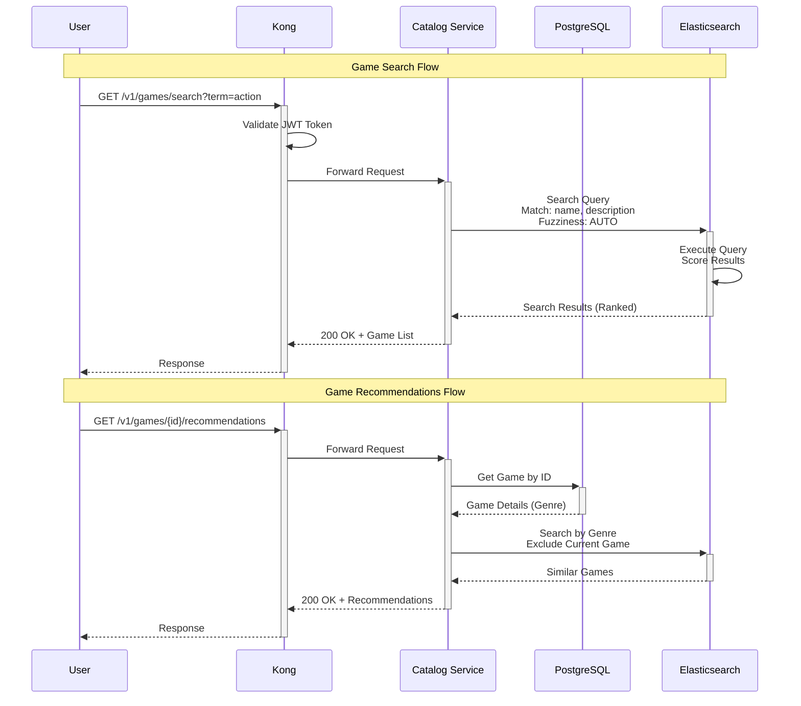
```mermaid
sequenceDiagram
    participant User
    participant Kong
    participant Catalog as Catalog Service
    participant DB as PostgreSQL
    participant ES as Elasticsearch

    Note over User,ES: Game Search Flow
    
    User->>+Kong: GET /v1/games/search?term=action
    Kong->>Kong: Validate JWT Token
    Kong->>+Catalog: Forward Request
    
    Catalog->>+ES: Search Query<br/>Match: name, description<br/>Fuzziness: AUTO
    ES->>ES: Execute Query<br/>Score Results
    ES-->>-Catalog: Search Results (Ranked)
    
    Catalog-->>-Kong: 200 OK + Game List
    Kong-->>-User: Response
    
    Note over User,ES: Game Recommendations Flow
    
    User->>+Kong: GET /v1/games/{id}/recommendations
    Kong->>+Catalog: Forward Request
    
    Catalog->>+DB: Get Game by ID
    DB-->>-Catalog: Game Details (Genre)
    
    Catalog->>+ES: Search by Genre<br/>Exclude Current Game
    ES-->>-Catalog: Similar Games
    
    Catalog-->>-Kong: 200 OK + Recommendations
    Kong-->>-User: Response
```

### 📚 Gerenciamento de Biblioteca de Usuário

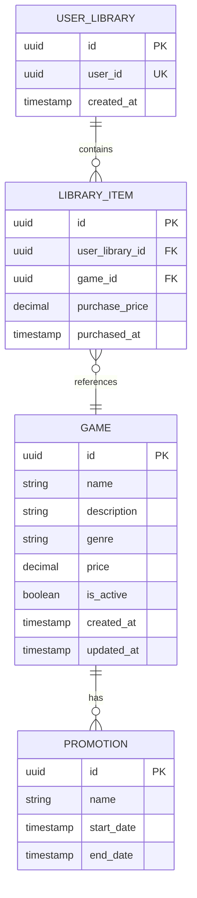
```mermaid
erDiagram
    USER_LIBRARY ||--o{ LIBRARY_ITEM : contains
    LIBRARY_ITEM }o--|| GAME : references
    GAME ||--o{ PROMOTION : has
    
    USER_LIBRARY {
        uuid id PK
        uuid user_id UK
        timestamp created_at
    }
    
    LIBRARY_ITEM {
        uuid id PK
        uuid user_library_id FK
        uuid game_id FK
        decimal purchase_price
        timestamp purchased_at
    }
    
    GAME {
        uuid id PK
        string name
        string description
        string genre
        decimal price
        boolean is_active
        timestamp created_at
        timestamp updated_at
    }
    
    PROMOTION {
        uuid id PK
        string name
        timestamp start_date
        timestamp end_date
    }
```

---

## 💳 Payment Service

### 💰 Gestão de Carteira

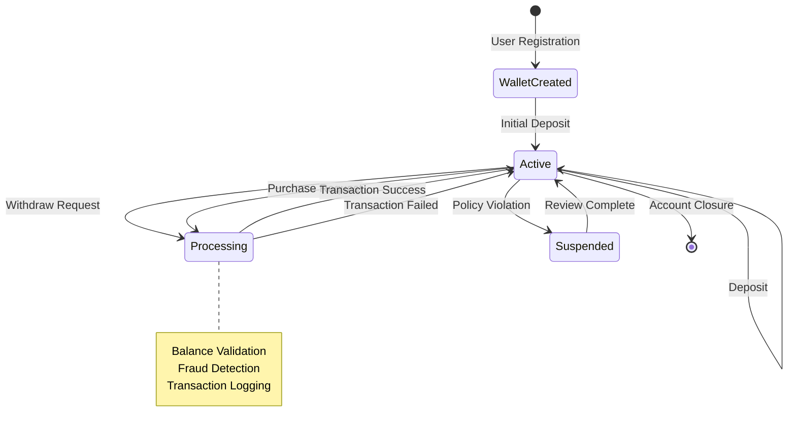
```mermaid
stateDiagram-v2
    [*] --> WalletCreated: User Registration
    
    WalletCreated --> Active: Initial Deposit
    
    Active --> Processing: Withdraw Request
    Active --> Processing: Purchase Request
    Active --> Active: Deposit
    
    Processing --> Active: Transaction Success
    Processing --> Active: Transaction Failed
    
    Active --> Suspended: Policy Violation
    Suspended --> Active: Review Complete
    
    Active --> [*]: Account Closure
    
    note right of Processing
        Balance Validation
        Fraud Detection
        Transaction Logging
    end note
```

### 🔄 CQRS e Event Sourcing

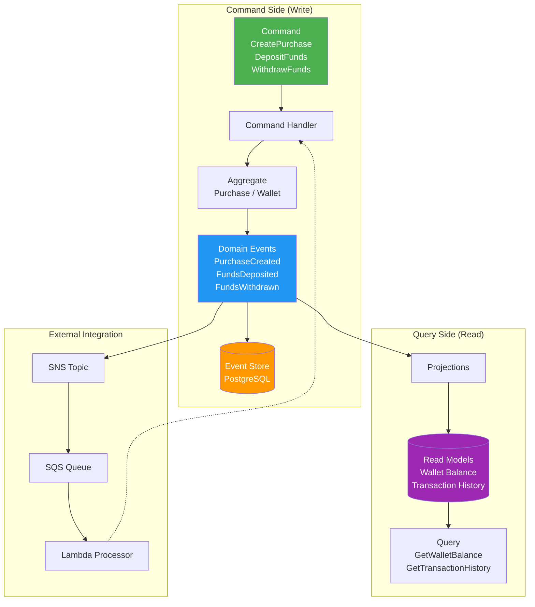
```mermaid
flowchart TB
    subgraph "Command Side (Write)"
        CMD[Command<br/>CreatePurchase<br/>DepositFunds<br/>WithdrawFunds]
        HANDLER[Command Handler]
        AGGREGATE[Aggregate<br/>Purchase / Wallet]
        EVENTS[Domain Events<br/>PurchaseCreated<br/>FundsDeposited<br/>FundsWithdrawn]
        EVENT_STORE[(Event Store<br/>PostgreSQL)]
    end
    
    subgraph "Query Side (Read)"
        PROJECTION[Projections]
        READ_MODEL[(Read Models<br/>Wallet Balance<br/>Transaction History)]
        QUERY[Query<br/>GetWalletBalance<br/>GetTransactionHistory]
    end
    
    subgraph "External Integration"
        SQS[SQS Queue]
        LAMBDA[Lambda Processor]
        SNS[SNS Topic]
    end
    
    CMD --> HANDLER
    HANDLER --> AGGREGATE
    AGGREGATE --> EVENTS
    EVENTS --> EVENT_STORE
    EVENTS --> PROJECTION
    PROJECTION --> READ_MODEL
    READ_MODEL --> QUERY
    
    EVENTS --> SNS
    SNS --> SQS
    SQS --> LAMBDA
    LAMBDA -.-> HANDLER
    
    style CMD fill:#4caf50,color:#fff
    style EVENTS fill:#2196f3,color:#fff
    style EVENT_STORE fill:#ff9800,color:#fff
    style READ_MODEL fill:#9c27b0,color:#fff
```

---

## 🛒 Fluxo Completo de Compra

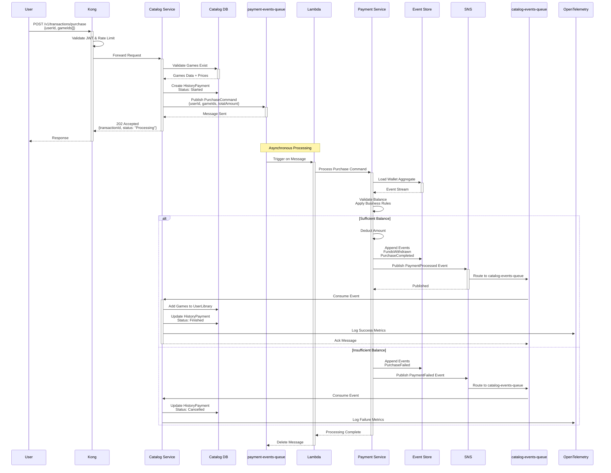
```mermaid
sequenceDiagram
    participant User
    participant Kong
    participant Catalog as Catalog Service
    participant CatalogDB as Catalog DB
    participant SQS1 as payment-events-queue
    participant Lambda
    participant Payment as Payment Service
    participant EventStore as Event Store
    participant SNS
    participant SQS2 as catalog-events-queue
    participant OTEL as OpenTelemetry

    User->>+Kong: POST /v1/transactions/purchase<br/>{userId, gameIds[]}
    Kong->>Kong: Validate JWT & Rate Limit
    Kong->>+Catalog: Forward Request
    
    Catalog->>+CatalogDB: Validate Games Exist
    CatalogDB-->>-Catalog: Games Data + Prices
    
    Catalog->>CatalogDB: Create HistoryPayment<br/>Status: Started
    
    Catalog->>+SQS1: Publish PurchaseCommand<br/>{userId, gameIds, totalAmount}
    SQS1-->>-Catalog: Message Sent
    
    Catalog-->>-Kong: 202 Accepted<br/>{transactionId, status: "Processing"}
    Kong-->>-User: Response
    
    Note over SQS1,Lambda: Asynchronous Processing
    
    SQS1->>+Lambda: Trigger on Message
    Lambda->>+Payment: Process Purchase Command
    
    Payment->>+EventStore: Load Wallet Aggregate
    EventStore-->>-Payment: Event Stream
    
    Payment->>Payment: Validate Balance<br/>Apply Business Rules
    
    alt Sufficient Balance
        Payment->>Payment: Deduct Amount
        Payment->>EventStore: Append Events<br/>FundsWithdrawn<br/>PurchaseCompleted
        Payment->>+SNS: Publish PaymentProcessed Event
        SNS->>+SQS2: Route to catalog-events-queue
        SNS-->>-Payment: Published
        
        SQS2->>+Catalog: Consume Event
        Catalog->>CatalogDB: Add Games to UserLibrary
        Catalog->>CatalogDB: Update HistoryPayment<br/>Status: Finished
        Catalog->>+OTEL: Log Success Metrics
        Catalog-->>-SQS2: Ack Message
        
    else Insufficient Balance
        Payment->>EventStore: Append Events<br/>PurchaseFailed
        Payment->>SNS: Publish PaymentFailed Event
        SNS->>SQS2: Route to catalog-events-queue
        
        SQS2->>Catalog: Consume Event
        Catalog->>CatalogDB: Update HistoryPayment<br/>Status: Cancelled
        Catalog->>OTEL: Log Failure Metrics
    end
    
    Payment-->>-Lambda: Processing Complete
    Lambda-->>-SQS1: Delete Message
```

---

## 🔙 Fluxo Completo de Reembolso

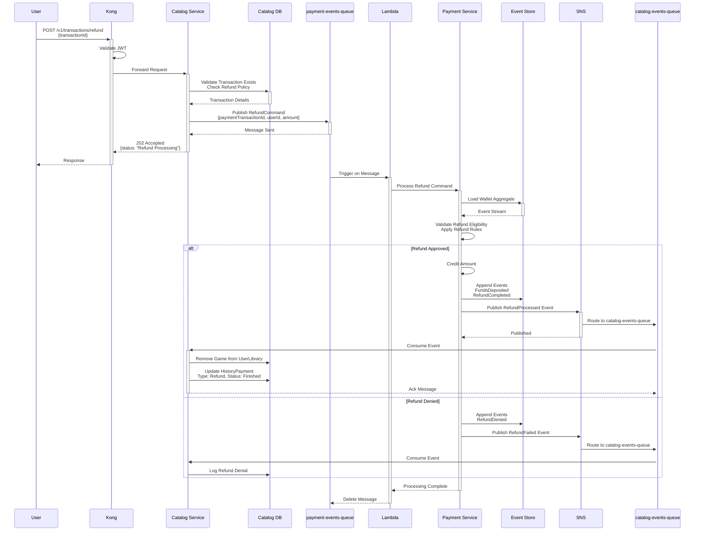
```mermaid
sequenceDiagram
    participant User
    participant Kong
    participant Catalog as Catalog Service
    participant CatalogDB as Catalog DB
    participant SQS1 as payment-events-queue
    participant Lambda
    participant Payment as Payment Service
    participant EventStore as Event Store
    participant SNS
    participant SQS2 as catalog-events-queue

    User->>+Kong: POST /v1/transactions/refund<br/>{transactionId}
    Kong->>Kong: Validate JWT
    Kong->>+Catalog: Forward Request
    
    Catalog->>+CatalogDB: Validate Transaction Exists<br/>Check Refund Policy
    CatalogDB-->>-Catalog: Transaction Details
    
    Catalog->>+SQS1: Publish RefundCommand<br/>{paymentTransactionId, userId, amount}
    SQS1-->>-Catalog: Message Sent
    
    Catalog-->>-Kong: 202 Accepted<br/>{status: "Refund Processing"}
    Kong-->>-User: Response
    
    SQS1->>+Lambda: Trigger on Message
    Lambda->>+Payment: Process Refund Command
    
    Payment->>+EventStore: Load Wallet Aggregate
    EventStore-->>-Payment: Event Stream
    
    Payment->>Payment: Validate Refund Eligibility<br/>Apply Refund Rules
    
    alt Refund Approved
        Payment->>Payment: Credit Amount
        Payment->>EventStore: Append Events<br/>FundsDeposited<br/>RefundCompleted
        Payment->>+SNS: Publish RefundProcessed Event
        SNS->>+SQS2: Route to catalog-events-queue
        SNS-->>-Payment: Published
        
        SQS2->>+Catalog: Consume Event
        Catalog->>CatalogDB: Remove Game from UserLibrary
        Catalog->>CatalogDB: Update HistoryPayment<br/>Type: Refund, Status: Finished
        Catalog-->>-SQS2: Ack Message
        
    else Refund Denied
        Payment->>EventStore: Append Events<br/>RefundDenied
        Payment->>SNS: Publish RefundFailed Event
        SNS->>SQS2: Route to catalog-events-queue
        
        SQS2->>Catalog: Consume Event
        Catalog->>CatalogDB: Log Refund Denial
    end
    
    Payment-->>-Lambda: Processing Complete
    Lambda-->>-SQS1: Delete Message
```

---

## 📊 Monitoramento e Observabilidade

### 📈 Observability Stack

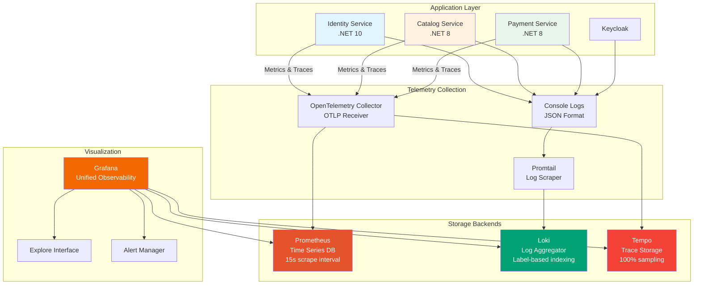
```mermaid
flowchart TB
    subgraph "Application Layer"
        IDENTITY[Identity Service<br/>.NET 10]
        CATALOG[Catalog Service<br/>.NET 8]
        PAYMENT[Payment Service<br/>.NET 8]
        KEYCLOAK[Keycloak]
    end
    
    subgraph "Telemetry Collection"
        OTEL[OpenTelemetry Collector<br/>OTLP Receiver]
        CONSOLE[Console Logs<br/>JSON Format]
        PROMTAIL[Promtail<br/>Log Scraper]
    end
    
    subgraph "Storage Backends"
        PROMETHEUS[Prometheus<br/>Time Series DB<br/>15s scrape interval]
        LOKI[Loki<br/>Log Aggregator<br/>Label-based indexing]
        TEMPO[Tempo<br/>Trace Storage<br/>100% sampling]
    end
    
    subgraph "Visualization"
        GRAFANA[Grafana<br/>Unified Observability]
        EXPLORE[Explore Interface]
        ALERTS[Alert Manager]
    end

    IDENTITY -->|Metrics & Traces| OTEL
    CATALOG -->|Metrics & Traces| OTEL
    PAYMENT -->|Metrics & Traces| OTEL
    IDENTITY --> CONSOLE
    CATALOG --> CONSOLE
    PAYMENT --> CONSOLE
    KEYCLOAK --> CONSOLE
    
    CONSOLE --> PROMTAIL
    PROMTAIL --> LOKI
    OTEL --> PROMETHEUS
    OTEL --> TEMPO
    
    GRAFANA --> PROMETHEUS
    GRAFANA --> LOKI
    GRAFANA --> TEMPO
    GRAFANA --> EXPLORE
    GRAFANA --> ALERTS
    
    style IDENTITY fill:#e1f5fe
    style CATALOG fill:#fff3e0
    style PAYMENT fill:#e8f5e9
    style GRAFANA fill:#f46800,color:#fff
    style PROMETHEUS fill:#e6522c,color:#fff
    style LOKI fill:#00a273,color:#fff
    style TEMPO fill:#f44336,color:#fff
```

### 🔍 Telemetry Flow & Correlation

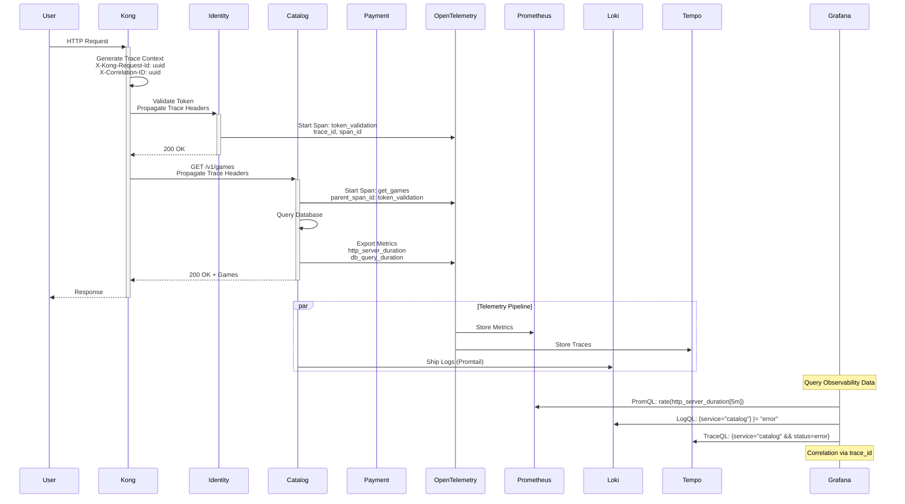
```mermaid
sequenceDiagram
    participant User
    participant Kong
    participant Identity
    participant Catalog
    participant Payment
    participant OTEL as OpenTelemetry
    participant Prom as Prometheus
    participant Loki
    participant Tempo
    participant Grafana

    User->>+Kong: HTTP Request
    Kong->>Kong: Generate Trace Context<br/>X-Kong-Request-Id: uuid<br/>X-Correlation-ID: uuid
    
    Kong->>+Identity: Validate Token<br/>Propagate Trace Headers
    Identity->>OTEL: Start Span: token_validation<br/>trace_id, span_id
    Identity-->>-Kong: 200 OK
    
    Kong->>+Catalog: GET /v1/games<br/>Propagate Trace Headers
    Catalog->>OTEL: Start Span: get_games<br/>parent_span_id: token_validation
    Catalog->>Catalog: Query Database
    Catalog->>OTEL: Export Metrics<br/>http_server_duration<br/>db_query_duration
    Catalog-->>-Kong: 200 OK + Games
    
    Kong-->>-User: Response
    
    par Telemetry Pipeline
        OTEL->>Prom: Store Metrics
        OTEL->>Tempo: Store Traces
        Catalog->>Loki: Ship Logs (Promtail)
    end
    
    Note over Grafana: Query Observability Data
    Grafana->>Prom: PromQL: rate(http_server_duration[5m])
    Grafana->>Loki: LogQL: {service="catalog"} |= "error"
    Grafana->>Tempo: TraceQL: {service="catalog" && status=error}
    
    Note over Grafana: Correlation via trace_id
```

### 📊 OpenTelemetry Configuration

```yaml
# OpenTelemetry Collector Configuration
receivers:
  otlp:
    protocols:
      grpc:
        endpoint: 0.0.0.0:4317
      http:
        endpoint: 0.0.0.0:4318

processors:
  batch:
    timeout: 10s
    send_batch_size: 1024
  memory_limiter:
    check_interval: 1s
    limit_mib: 512
  resource:
    attributes:
      - key: deployment.environment
        value: production
        action: upsert

exporters:
  prometheus:
    endpoint: "0.0.0.0:8889"
    namespace: fcg_platform
    const_labels:
      platform: fiap-cloud-games
  otlp/tempo:
    endpoint: tempo:4317
    tls:
      insecure: true
  loki:
    endpoint: http://loki:3100/loki/api/v1/push

service:
  pipelines:
    metrics:
      receivers: [otlp]
      processors: [memory_limiter, batch, resource]
      exporters: [prometheus]
    traces:
      receivers: [otlp]
      processors: [memory_limiter, batch, resource]
      exporters: [otlp/tempo]
    logs:
      receivers: [otlp]
      processors: [memory_limiter, batch, resource]
      exporters: [loki]
```

**Datasources Grafana:**
```yaml
apiVersion: 1
datasources:
  - name: Prometheus
    type: prometheus
    access: proxy
    url: http://prometheus:9090
    uid: prometheus
    isDefault: true
    jsonData:
      timeInterval: 15s
      queryTimeout: 30s

  - name: Loki
    type: loki
    access: proxy
    url: http://loki:3100
    uid: loki
    jsonData:
      derivedFields:
        - datasourceUid: tempo
          matcherRegex: "trace_id=(\\w+)"
          name: TraceID
          url: "$${__value.raw}"

  - name: Tempo
    type: tempo
    access: proxy
    url: http://tempo:3200
    uid: tempo
    jsonData:
      tracesToLogs:
        datasourceUid: loki
        filterByTraceID: true
      tracesToMetrics:
        datasourceUid: prometheus
      serviceMap:
        datasourceUid: prometheus
```

---

## 🗄️ Modelo de Dados

### 💾 Identity Service Database

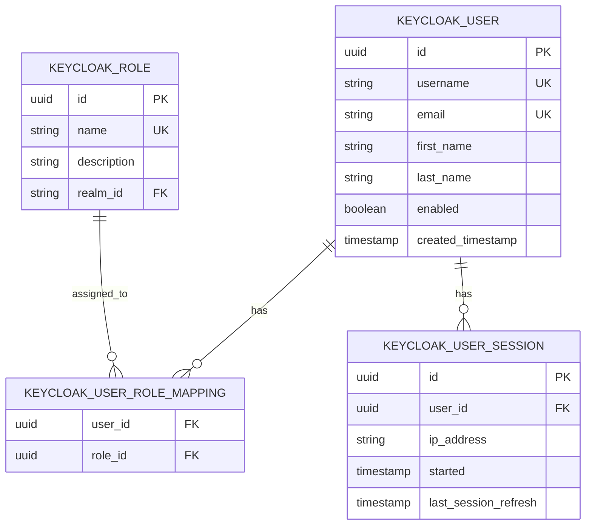
```mermaid
erDiagram
    KEYCLOAK_USER ||--o{ KEYCLOAK_USER_ROLE_MAPPING : has
    KEYCLOAK_ROLE ||--o{ KEYCLOAK_USER_ROLE_MAPPING : assigned_to
    KEYCLOAK_USER ||--o{ KEYCLOAK_USER_SESSION : has
    
    KEYCLOAK_USER {
        uuid id PK
        string username UK
        string email UK
        string first_name
        string last_name
        boolean enabled
        timestamp created_timestamp
    }
    
    KEYCLOAK_ROLE {
        uuid id PK
        string name UK
        string description
        string realm_id FK
    }
    
    KEYCLOAK_USER_ROLE_MAPPING {
        uuid user_id FK
        uuid role_id FK
    }
    
    KEYCLOAK_USER_SESSION {
        uuid id PK
        uuid user_id FK
        string ip_address
        timestamp started
        timestamp last_session_refresh
    }
```

### 🎲 Games Catalog Database

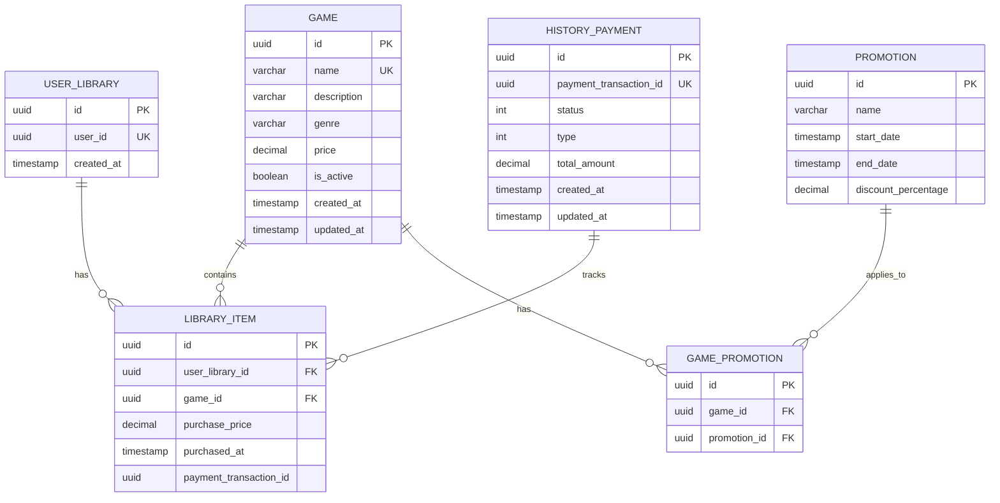
```mermaid
erDiagram
    GAME ||--o{ LIBRARY_ITEM : contains
    USER_LIBRARY ||--o{ LIBRARY_ITEM : has
    GAME ||--o{ GAME_PROMOTION : has
    PROMOTION ||--o{ GAME_PROMOTION : applies_to
    HISTORY_PAYMENT ||--o{ LIBRARY_ITEM : tracks
    
    GAME {
        uuid id PK
        varchar name UK
        varchar description
        varchar genre
        decimal price
        boolean is_active
        timestamp created_at
        timestamp updated_at
    }
    
    USER_LIBRARY {
        uuid id PK
        uuid user_id UK
        timestamp created_at
    }
    
    LIBRARY_ITEM {
        uuid id PK
        uuid user_library_id FK
        uuid game_id FK
        decimal purchase_price
        timestamp purchased_at
        uuid payment_transaction_id
    }
    
    PROMOTION {
        uuid id PK
        varchar name
        timestamp start_date
        timestamp end_date
        decimal discount_percentage
    }
    
    GAME_PROMOTION {
        uuid id PK
        uuid game_id FK
        uuid promotion_id FK
    }
    
    HISTORY_PAYMENT {
        uuid id PK
        uuid payment_transaction_id UK
        int status
        int type
        decimal total_amount
        timestamp created_at
        timestamp updated_at
    }
```

### 💵 Payment Service Database

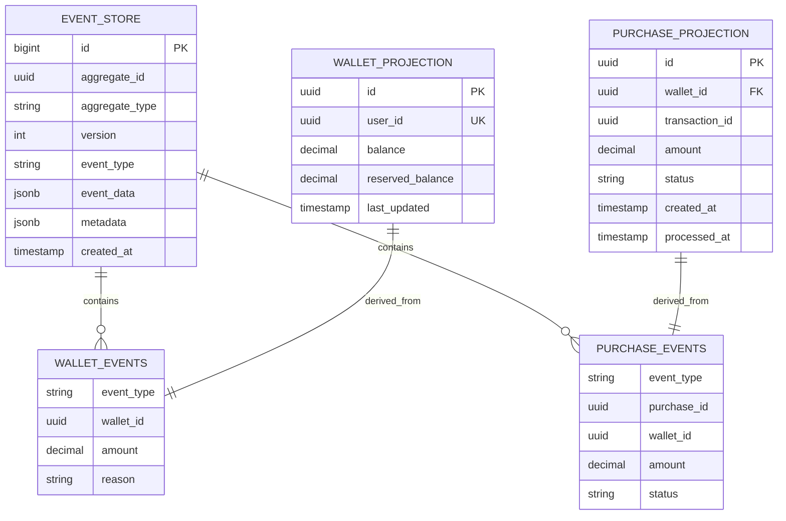
```mermaid
erDiagram
    EVENT_STORE ||--o{ WALLET_EVENTS : contains
    EVENT_STORE ||--o{ PURCHASE_EVENTS : contains
    WALLET_PROJECTION ||--|| WALLET_EVENTS : derived_from
    PURCHASE_PROJECTION ||--|| PURCHASE_EVENTS : derived_from
    
    EVENT_STORE {
        bigint id PK
        uuid aggregate_id
        string aggregate_type
        int version
        string event_type
        jsonb event_data
        jsonb metadata
        timestamp created_at
    }
    
    WALLET_EVENTS {
        string event_type
        uuid wallet_id
        decimal amount
        string reason
    }
    
    PURCHASE_EVENTS {
        string event_type
        uuid purchase_id
        uuid wallet_id
        decimal amount
        string status
    }
    
    WALLET_PROJECTION {
        uuid id PK
        uuid user_id UK
        decimal balance
        decimal reserved_balance
        timestamp last_updated
    }
    
    PURCHASE_PROJECTION {
        uuid id PK
        uuid wallet_id FK
        uuid transaction_id
        decimal amount
        string status
        timestamp created_at
        timestamp processed_at
    }
```

---

## ☁️ Infraestrutura AWS

### 🎯 Componentes AWS

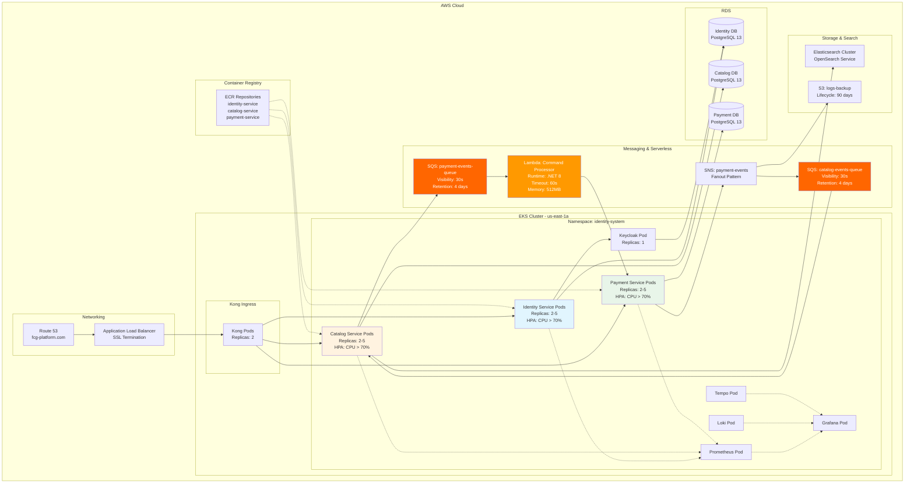
```mermaid
graph TB
    subgraph "AWS Cloud"
        subgraph "EKS Cluster - us-east-1a"
            subgraph "Namespace: identity-system"
                IDENTITY_POD[Identity Service Pods<br/>Replicas: 2-5<br/>HPA: CPU > 70%]
                CATALOG_POD[Catalog Service Pods<br/>Replicas: 2-5<br/>HPA: CPU > 70%]
                PAYMENT_POD[Payment Service Pods<br/>Replicas: 2-5<br/>HPA: CPU > 70%]
                KC_POD[Keycloak Pod<br/>Replicas: 1]
                PROM_POD[Prometheus Pod]
                LOKI_POD[Loki Pod]
                TEMPO_POD[Tempo Pod]
                GRAFANA_POD[Grafana Pod]
            end
            
            subgraph "Kong Ingress"
                KONG_POD[Kong Pods<br/>Replicas: 2]
            end
        end
        
        subgraph "RDS"
            IDENTITY_DB[(Identity DB<br/>PostgreSQL 13)]
            CATALOG_DB[(Catalog DB<br/>PostgreSQL 13)]
            PAYMENT_DB[(Payment DB<br/>PostgreSQL 13)]
        end
        
        subgraph "Messaging & Serverless"
            SQS_PAYMENT[SQS: payment-events-queue<br/>Visibility: 30s<br/>Retention: 4 days]
            SQS_CATALOG[SQS: catalog-events-queue<br/>Visibility: 30s<br/>Retention: 4 days]
            SNS_TOPIC[SNS: payment-events<br/>Fanout Pattern]
            LAMBDA_FUNC[Lambda: Command Processor<br/>Runtime: .NET 8<br/>Timeout: 60s<br/>Memory: 512MB]
        end
        
        subgraph "Storage & Search"
            ES_CLUSTER[Elasticsearch Cluster<br/>OpenSearch Service]
            S3_BUCKET[S3: logs-backup<br/>Lifecycle: 90 days]
        end
        
        subgraph "Networking"
            ALB[Application Load Balancer<br/>SSL Termination]
            ROUTE53[Route 53<br/>fcg-platform.com]
        end
        
        subgraph "Container Registry"
            ECR[ECR Repositories<br/>identity-service<br/>catalog-service<br/>payment-service]
        end
    end
    
    ROUTE53 --> ALB
    ALB --> KONG_POD
    KONG_POD --> IDENTITY_POD
    KONG_POD --> CATALOG_POD
    KONG_POD --> PAYMENT_POD
    
    IDENTITY_POD --> IDENTITY_DB
    IDENTITY_POD --> KC_POD
    KC_POD --> IDENTITY_DB
    
    CATALOG_POD --> CATALOG_DB
    CATALOG_POD --> ES_CLUSTER
    CATALOG_POD --> SQS_PAYMENT
    
    PAYMENT_POD --> PAYMENT_DB
    PAYMENT_POD --> SNS_TOPIC
    
    SNS_TOPIC --> SQS_CATALOG
    SNS_TOPIC --> S3_BUCKET
    SQS_PAYMENT --> LAMBDA_FUNC
    SQS_CATALOG --> CATALOG_POD
    LAMBDA_FUNC --> PAYMENT_POD
    
    IDENTITY_POD -.-> PROM_POD
    CATALOG_POD -.-> PROM_POD
    PAYMENT_POD -.-> PROM_POD
    PROM_POD -.-> GRAFANA_POD
    LOKI_POD -.-> GRAFANA_POD
    TEMPO_POD -.-> GRAFANA_POD
    
    ECR -.-> IDENTITY_POD
    ECR -.-> CATALOG_POD
    ECR -.-> PAYMENT_POD
    
    style IDENTITY_POD fill:#e1f5fe
    style CATALOG_POD fill:#fff3e0
    style PAYMENT_POD fill:#e8f5e9
    style LAMBDA_FUNC fill:#ff9900,color:#fff
    style SQS_PAYMENT fill:#ff6600,color:#fff
    style SQS_CATALOG fill:#ff6600,color:#fff
```

### ⚙️ Event-Driven Architecture

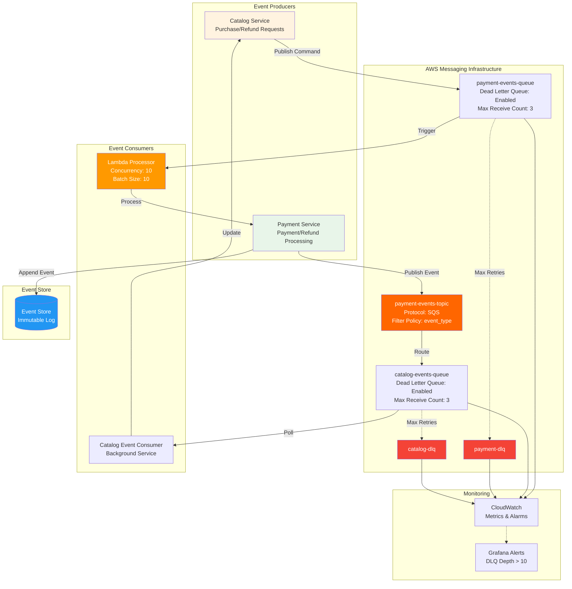
```mermaid
flowchart TB
    subgraph "Event Producers"
        CATALOG[Catalog Service<br/>Purchase/Refund Requests]
        PAYMENT[Payment Service<br/>Payment/Refund Processing]
    end
    
    subgraph "AWS Messaging Infrastructure"
        SQS1[payment-events-queue<br/>Dead Letter Queue: Enabled<br/>Max Receive Count: 3]
        SNS[payment-events-topic<br/>Protocol: SQS<br/>Filter Policy: event_type]
        SQS2[catalog-events-queue<br/>Dead Letter Queue: Enabled<br/>Max Receive Count: 3]
        DLQ1[payment-dlq]
        DLQ2[catalog-dlq]
    end
    
    subgraph "Event Consumers"
        LAMBDA[Lambda Processor<br/>Concurrency: 10<br/>Batch Size: 10]
        CATALOG_CONSUMER[Catalog Event Consumer<br/>Background Service]
    end
    
    subgraph "Event Store"
        EVENT_STORE[(Event Store<br/>Immutable Log)]
    end
    
    subgraph "Monitoring"
        CW[CloudWatch<br/>Metrics & Alarms]
        GRAFANA_ALERTS[Grafana Alerts<br/>DLQ Depth > 10]
    end
    
    CATALOG -->|Publish Command| SQS1
    SQS1 -->|Trigger| LAMBDA
    LAMBDA -->|Process| PAYMENT
    PAYMENT -->|Append Event| EVENT_STORE
    PAYMENT -->|Publish Event| SNS
    
    SNS -->|Route| SQS2
    SQS2 -->|Poll| CATALOG_CONSUMER
    CATALOG_CONSUMER -->|Update| CATALOG
    
    SQS1 -.->|Max Retries| DLQ1
    SQS2 -.->|Max Retries| DLQ2
    
    SQS1 --> CW
    SQS2 --> CW
    DLQ1 --> CW
    DLQ2 --> CW
    CW -.-> GRAFANA_ALERTS
    
    style CATALOG fill:#fff3e0
    style PAYMENT fill:#e8f5e9
    style LAMBDA fill:#ff9900,color:#fff
    style SNS fill:#ff6600,color:#fff
    style DLQ1 fill:#f44336,color:#fff
    style DLQ2 fill:#f44336,color:#fff
    style EVENT_STORE fill:#2196f3,color:#fff
```

---

## ⚙️ Especificações Técnicas

### 🏷️ Versões e Dependências

| Componente | Versão | Descrição |
|------------|--------|-----------|
| **Identity Service** | 1.0.0 | Microsserviço de autenticação |
| **.NET (Identity)** | 10.0 | Framework principal |
| **ASP.NET Core (Identity)** | 10.0.1 | Web API framework |
| **Catalog Service** | 1.0.0 | Microsserviço de catálogo |
| **.NET (Catalog)** | 8.0 | Framework principal |
| **Payment Service** | 1.0.0 | Microsserviço de pagamentos |
| **.NET (Payment)** | 8.0 | Framework principal |
| **Keycloak** | 22.0 | Identity Provider |
| **PostgreSQL** | 13-alpine | Databases (Identity, Catalog, Payment) |
| **Elasticsearch** | 8.x | Search engine & analytics |
| **Kong Ingress** | 3.x | API Gateway |
| **Kubernetes** | v1.34 | Container orchestration |
| **AWS EKS** | v1.34 | Managed Kubernetes |
| **AWS Lambda** | .NET 8 Runtime | Serverless compute |
| **AWS SQS** | - | Message queuing |
| **AWS SNS** | - | Pub/Sub messaging |
| **Prometheus** | 3.2.1 | Metrics collection |
| **Loki** | 3.3.1 | Log aggregation |
| **Tempo** | 2.7.2 | Distributed tracing |
| **Grafana** | 11.3.1 | Observability visualization |
| **OpenTelemetry Collector** | 0.115.1 | Telemetry pipeline |
| **Promtail** | 3.3.1 | Log scraper |

### 📊 Performance Specifications

| Métrica | Valor | Observação |
|---------|-------|------------|
| **Identity Service** |  |  |
| Response Time (p95) | ~100-200ms | Incluindo validação Keycloak |
| Throughput | 200 req/min | Rate limit por IP |
| **Catalog Service** |  |  |
| Response Time (p95) | ~150-300ms | Incluindo queries Elasticsearch |
| Throughput | 500 req/min | Rate limit por usuário |
| Search Latency | <100ms | Elasticsearch queries |
| **Payment Service** |  |  |
| Response Time (p95) | ~200-400ms | Processamento de comandos |
| Throughput | 300 req/min | Rate limit por usuário |
| Event Processing | <500ms | Lambda cold start incluído |
| **Infrastructure** |  |  |
| Uptime SLA | 99.9% | Monitorado via Prometheus |
| Kong Proxy Latency | ~1ms | Overhead mínimo |
| Metrics Scrape Interval | 15s | Prometheus collection |
| Log Indexing Latency | <3s | Loki real-time indexing |
| Trace Sampling Rate | 100% | All traces captured in Tempo |
| **Kubernetes** |  |  |
| Pod Autoscaling | CPU > 70% | HPA configuration |
| Min Replicas | 2 per service | High availability |
| Max Replicas | 5 per service | Cost optimization |
| Memory Limit | 4GB per pod | Otimizado para .NET |
| CPU Limit | 2 cores per pod | m7i.flex.large instances |
| **AWS Messaging** |  |  |
| SQS Visibility Timeout | 30s | Message processing window |
| SQS Message Retention | 4 days | Retention period |
| SQS Max Receive Count | 3 | Before moving to DLQ |
| Lambda Timeout | 60s | Max execution time |
| Lambda Memory | 512MB | Allocated memory |
| Lambda Concurrency | 10 | Max concurrent executions |

---

**Documento Gerado em:** `21/12/2025`  
**Versão da Plataforma:** `1.0.0`  
**Ambiente:** `Production (AWS EKS)`  
**Arquitetura:** `Microservices + Event-Driven + CQRS + Event Sourcing`  
**Stack de Observabilidade:** `✅ Prometheus + Loki + Tempo + Grafana + OpenTelemetry`  
**Cloud Provider:** `AWS (EKS, RDS, SQS, SNS, Lambda, ECR, Route 53)`  
**Status:** `✅ Produção com Observabilidade Completa`
