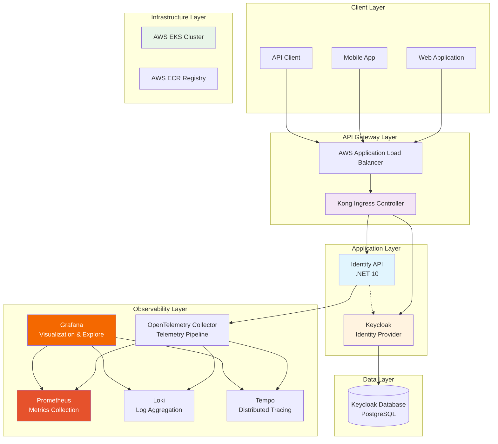
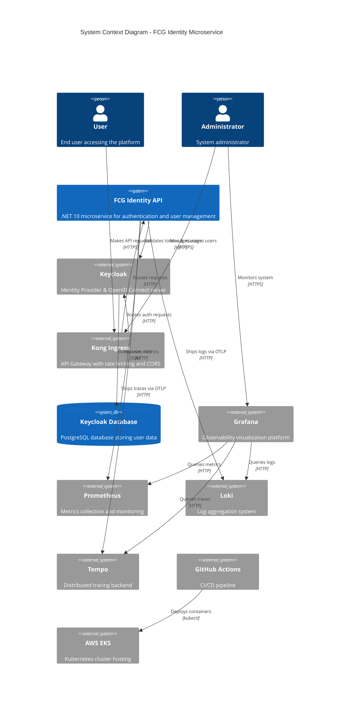
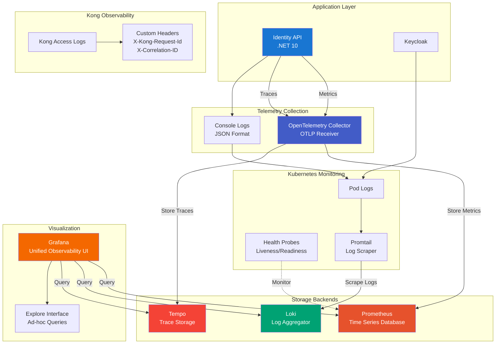
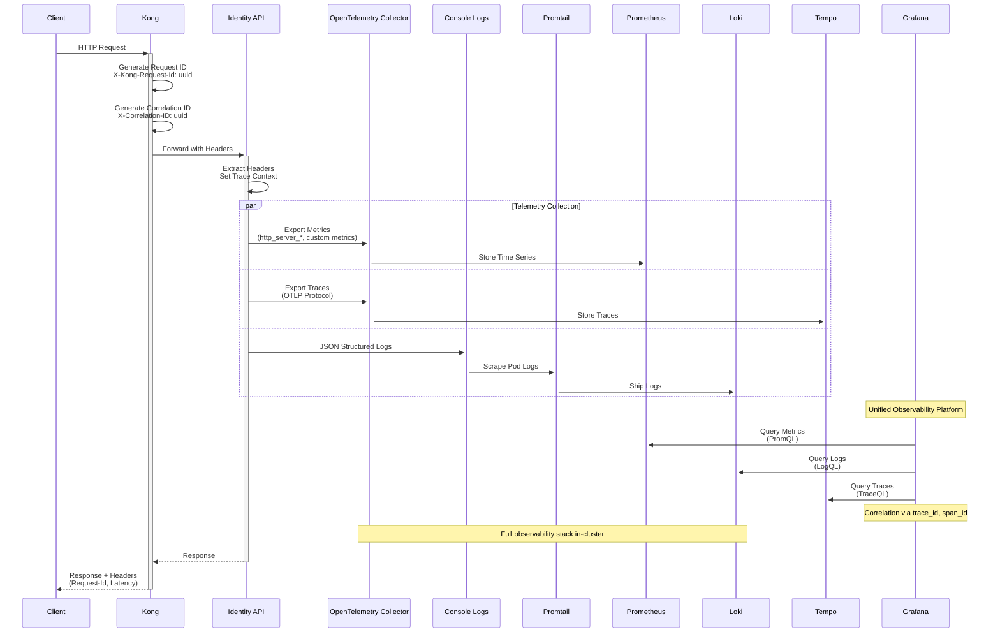
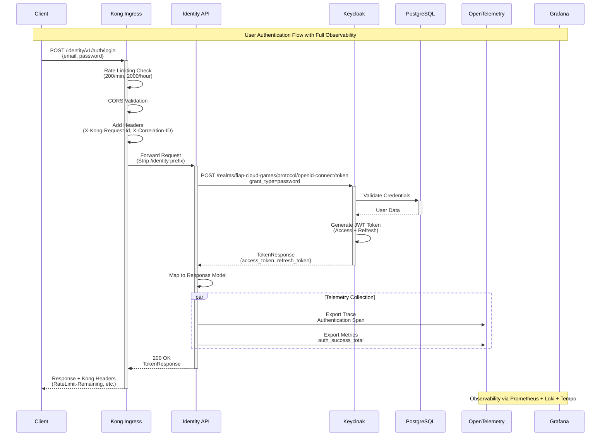
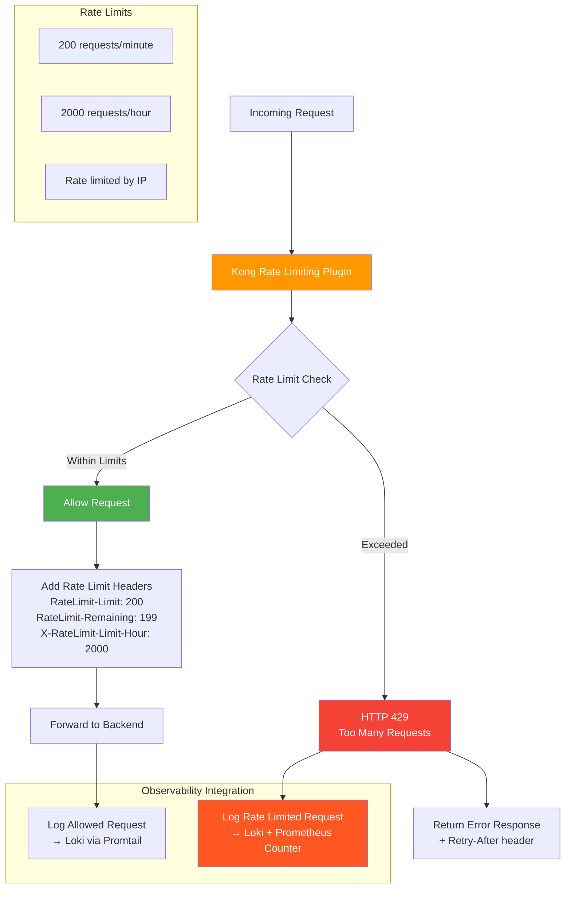

# 🏗️ Arquitetura Técnica - FCG Identity Microservice

## 📋 Índice
- [🏗️ Arquitetura Técnica - FCG Identity Microservice](#️-arquitetura-técnica---fcg-identity-microservice)
  - [📋 Índice](#-índice)
  - [🎯 Visão Geral da Arquitetura](#-visão-geral-da-arquitetura)
  - [🏛️ Arquitetura de Sistema](#️-arquitetura-de-sistema)
    - [🔧 Componentes Principais](#-componentes-principais)
  - [📊 Monitoramento e Observabilidade](#-monitoramento-e-observabilidade)
    - [📈 Observability Stack Completa](#-observability-stack-completa)
    - [🔍 Log Flow \& Correlation com Elasticsearch](#-log-flow--correlation-com-elasticsearch)
    - [📊 Elasticsearch Configuration](#-elasticsearch-configuration)
  - [🔐 Fluxo de Autenticação](#-fluxo-de-autenticação)
    - [🚪 Processo de Login Completo](#-processo-de-login-completo)
  - [🛡️ Segurança e Rate Limiting](#️-segurança-e-rate-limiting)
    - [🚦 Rate Limiting Strategy](#-rate-limiting-strategy)
  - [⚙️ Especificações Técnicas](#️-especificações-técnicas)
    - [🏷️ Versões e Dependências](#️-versões-e-dependências)
    - [📊 Performance Specifications](#-performance-specifications)

---

## 🎯 Visão Geral da Arquitetura

O **FCG Identity Microservice** é um sistema de autenticação e autorização enterprise desenvolvido em **.NET 10** seguindo os princípios de **Clean Architecture** e **Domain-Driven Design (DDD)**. O sistema utiliza **Keycloak** como Identity Provider e está deployado em **AWS EKS** com **Kong Ingress Controller**.



---

## 🏛️ Arquitetura de Sistema

### 🔧 Componentes Principais



---

## 📊 Monitoramento e Observabilidade

### 📈 Observability Stack Completa - Prometheus, Loki, Tempo & Grafana



### 🔍 Telemetry Flow & Correlation com OpenTelemetry



### 📊 OpenTelemetry Configuration

```yaml
# OpenTelemetry Collector Configuration
receivers:
  otlp:
    protocols:
      grpc:
        endpoint: 0.0.0.0:4317
      http:
        endpoint: 0.0.0.0:4318

processors:
  batch:
    timeout: 10s
    send_batch_size: 1024
  memory_limiter:
    check_interval: 1s
    limit_mib: 512

exporters:
  prometheus:
    endpoint: "0.0.0.0:8889"
    namespace: fcg_identity
  otlp/tempo:
    endpoint: tempo:4317
    tls:
      insecure: true
  loki:
    endpoint: http://loki:3100/loki/api/v1/push

service:
  pipelines:
    metrics:
      receivers: [otlp]
      processors: [memory_limiter, batch]
      exporters: [prometheus]
    traces:
      receivers: [otlp]
      processors: [memory_limiter, batch]
      exporters: [otlp/tempo]
    logs:
      receivers: [otlp]
      processors: [memory_limiter, batch]
      exporters: [loki]
```

**Datasources Grafana:**
```yaml
apiVersion: 1
datasources:
  - name: Prometheus
    type: prometheus
    access: proxy
    url: http://prometheus:9090
    uid: prometheus
    isDefault: true
    editable: false

  - name: Loki
    type: loki
    access: proxy
    url: http://loki:3100
    uid: loki
    editable: false
    jsonData:
      derivedFields:
        - datasourceUid: tempo
          matcherRegex: "trace_id=(\\w+)"
          name: TraceID
          url: "$${__value.raw}"

  - name: Tempo
    type: tempo
    access: proxy
    url: http://tempo:3200
    uid: tempo
    editable: false
    jsonData:
      tracesToLogs:
        datasourceUid: loki
        filterByTraceID: true
        filterBySpanID: false
      tracesToMetrics:
        datasourceUid: prometheus
      serviceMap:
        datasourceUid: prometheus
```

---

## 🔐 Fluxo de Autenticação

### 🚪 Processo de Login Completo



---

## 🛡️ Segurança e Rate Limiting

### 🚦 Rate Limiting Strategy



---

## ⚙️ Especificações Técnicas

### 🏷️ Versões e Dependências

| Componente | Versão | Descrição |
|------------|--------|-----------|
| **.NET** | 10.0 | Framework principal |
| **ASP.NET Core** | 10.0.1 | Web API framework |
| **Keycloak** | 22.0 | Identity Provider |
| **PostgreSQL** | 13-alpine | Database para Keycloak |
| **Kong Ingress** | Latest | API Gateway |
| **Kubernetes** | v1.34 | Container orchestration |
| **AWS EKS** | v1.34 | Managed Kubernetes |
| **Prometheus** | 3.2.1 | Metrics collection |
| **Loki** | 3.3.1 | Log aggregation |
| **Tempo** | 2.7.2 | Distributed tracing |
| **Grafana** | 11.3.1 | Observability visualization |
| **OpenTelemetry Collector** | 0.115.1 | Telemetry pipeline |
| **Promtail** | 3.3.1 | Log scraper |

### 📊 Performance Specifications

| Métrica | Valor | Observação |
|---------|-------|------------|
| **Response Time** | ~100-200ms (p95) | Incluindo validação Keycloak |
| **Throughput** | 200 req/min | Rate limit por IP |
| **Uptime SLA** | 99.9% | Monitorado via Prometheus |
| **Kong Proxy Latency** | ~1ms | Overhead mínimo |
| **Metrics Scrape Interval** | 15s | Prometheus collection |
| **Log Indexing Latency** | <3s | Loki real-time indexing |
| **Trace Sampling Rate** | 100% | All traces captured in Tempo |
| **Memory Usage** | <4GB per pod | Otimizado para .NET 10 |
| **CPU Usage** | <50% average | m7i.flex.large instances |

---

**Documento Gerado em:** `21/12/2025`  
**Versão da Aplicação:** `1.0.0`  
**Ambiente:** `Production (AWS EKS)`  
**Stack de Observabilidade:** `✅ Prometheus + Loki + Tempo + Grafana + OpenTelemetry`  
**Dashboards:** `Manual creation via Grafana Explore UI`  
**Status:** `✅ Produção com Observabilidade Completa`