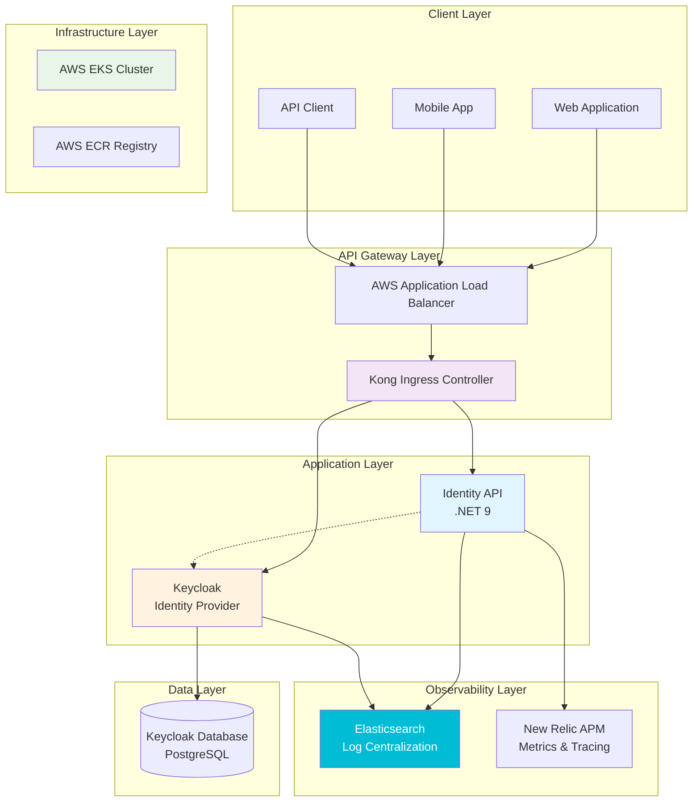
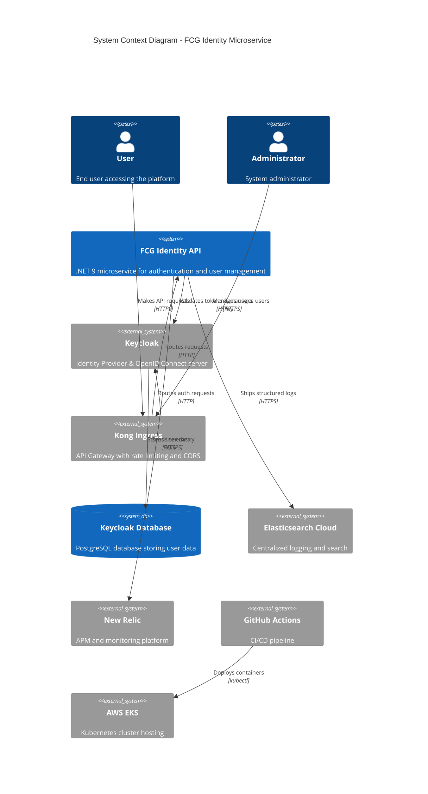
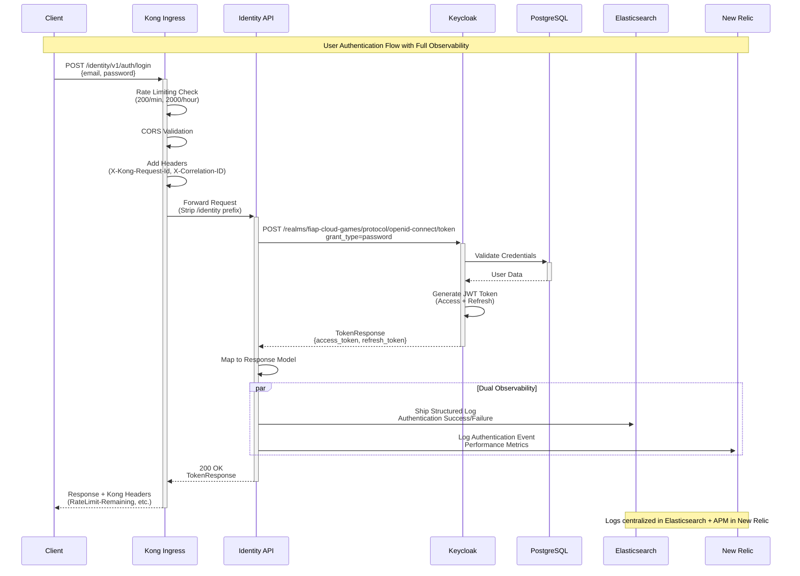

# 🏗️ Arquitetura Técnica - FCG Identity Microservice

## 📋 Índice
- [🏗️ Arquitetura Técnica - FCG Identity Microservice](#️-arquitetura-técnica---fcg-identity-microservice)
  - [📋 Índice](#-índice)
  - [🎯 Visão Geral da Arquitetura](#-visão-geral-da-arquitetura)
  - [🏛️ Arquitetura de Sistema](#️-arquitetura-de-sistema)
    - [🔧 Componentes Principais](#-componentes-principais)
  - [📊 Monitoramento e Observabilidade](#-monitoramento-e-observabilidade)
    - [📈 Observability Stack Completa](#-observability-stack-completa)
    - [🔍 Log Flow \& Correlation com Elasticsearch](#-log-flow--correlation-com-elasticsearch)
    - [📊 Elasticsearch Configuration](#-elasticsearch-configuration)
  - [🔐 Fluxo de Autenticação](#-fluxo-de-autenticação)
    - [🚪 Processo de Login Completo](#-processo-de-login-completo)
  - [🛡️ Segurança e Rate Limiting](#️-segurança-e-rate-limiting)
    - [🚦 Rate Limiting Strategy](#-rate-limiting-strategy)
  - [⚙️ Especificações Técnicas](#️-especificações-técnicas)
    - [🏷️ Versões e Dependências](#️-versões-e-dependências)
    - [📊 Performance Specifications](#-performance-specifications)

---

## 🎯 Visão Geral da Arquitetura

O **FCG Identity Microservice** é um sistema de autenticação e autorização enterprise desenvolvido em **.NET 9** seguindo os princípios de **Clean Architecture** e **Domain-Driven Design (DDD)**. O sistema utiliza **Keycloak** como Identity Provider e está deployado em **AWS EKS** com **Kong Ingress Controller**.



---

## 🏛️ Arquitetura de Sistema

### 🔧 Componentes Principais



---

## 📊 Monitoramento e Observabilidade

### 📈 Observability Stack Completa

```mermaid
flowchart TB
    subgraph "Application Layer"
        APP[Identity API<br/>.NET 9]
        KC_APP[Keycloak]
    end
    
    subgraph "Logging Layer"
        SERILOG[Serilog<br/>Structured Logging]
        CONSOLE[Console Sink<br/>JSON Format]
        ELASTIC_SINK[Elasticsearch Sink<br/>fcg-logs-{yyyy.MM.dd}]
    end
    
    subgraph "Metrics & Tracing"
        NR_AGENT[New Relic Agent]
        NR_API[New Relic API]
    end
    
    subgraph "Kong Observability"
        KONG_LOGS[Kong Access Logs]
        HEADERS[Custom Headers<br/>X-Kong-Request-Id<br/>X-Correlation-ID]
    end
    
    subgraph "Kubernetes Monitoring"
        K8S_LOGS[Pod Logs]
        HEALTH_CHECKS[Health Probes<br/>Liveness/Readiness]
    end
    
    subgraph "Log Centralization (GCP)"
        ELASTICSEARCH[Elasticsearch Cloud<br/>us-central1.gcp.elastic.cloud]
        ELASTIC_API[Elasticsearch API<br/>API Key Authentication]
    end
    
    subgraph "External Monitoring"
        NR_DASHBOARD[New Relic Dashboard]
        ALERTS[Custom Alerts]
    end

    APP --> SERILOG
    APP --> NR_AGENT
    KC_APP --> K8S_LOGS
    SERILOG --> CONSOLE
    SERILOG --> ELASTIC_SINK
    ELASTIC_SINK --> ELASTIC_API
    ELASTIC_API --> ELASTICSEARCH
    NR_AGENT --> NR_API
    KONG_LOGS --> HEADERS
    CONSOLE --> K8S_LOGS
    K8S_LOGS --> NR_DASHBOARD
    NR_API --> NR_DASHBOARD
    NR_DASHBOARD --> ALERTS
    
    style APP fill:#1976d2,color:#fff
    style ELASTICSEARCH fill:#00bcd4,color:#fff
    style NR_DASHBOARD fill:#4caf50,color:#fff
    style ALERTS fill:#f44336,color:#fff
```

### 🔍 Log Flow & Correlation com Elasticsearch

```mermaid
sequenceDiagram
    participant Client
    participant Kong
    participant API as Identity API
    participant Serilog
    participant Console as Console Logs
    participant Elastic as Elasticsearch
    participant K8s as Kubernetes
    participant NR as New Relic

    Client->>+Kong: HTTP Request
    Kong->>Kong: Generate Request ID<br/>X-Kong-Request-Id: uuid
    Kong->>Kong: Generate Correlation ID<br/>X-Correlation-ID: uuid#counter
    Kong->>+API: Forward with Headers
    
    API->>API: Extract Headers<br/>Set Log Context
    API->>+Serilog: Log with Context<br/>{RequestId, CorrelationId, UserId}
    
    par Dual Logging Strategy
        Serilog->>+Console: JSON Console Output
        Console->>K8s: Kubernetes Logs
    and 
        Serilog->>+Elastic: Ship to Elasticsearch<br/>Index: fcg-logs-{yyyy.MM.dd}
    end
    
    API->>+NR: Send Telemetry<br/>(Performance, Errors)
    
    K8s-->>-NR: Forward Logs<br/>(Optional Log Forwarding)
    
    Note over Elastic,NR: Centralized logging & APM monitoring
    Note over Serilog,NR: Correlation across all services
    
    Serilog-->>-API: Log Written
    API-->>-Kong: Response
    Kong-->>-Client: Response + Headers<br/>(Request-Id, Latency)
```

### 📊 Elasticsearch Configuration

```json
{
  "Serilog": {
    "Using": [
      "Serilog.Sinks.Console", 
      "Serilog.Sinks.Elasticsearch", 
      "NewRelic.LogEnrichers.Serilog"
    ],
    "MinimumLevel": {
      "Default": "Information",
      "Override": {
        "Microsoft": "Warning",
        "Microsoft.Hosting.Lifetime": "Information",
        "Microsoft.AspNetCore.Authentication": "Information",
        "System": "Warning"
      }
    },
    "WriteTo": [
      {
        "Name": "Console",
        "Args": {
          "outputTemplate": "[{Timestamp:HH:mm:ss} {Level:u3}] {Message:lj}{NewLine}{Exception} | RequestId: {RequestId} | CorrelationId: {CorrelationId} | UserId: {UserId} | Username: {Username} | SessionId: {SessionId} | Application: {ApplicationName}"
        }
      },
      {
        "Name": "Elasticsearch",
        "Args": {
          "nodeUris": "https://my-elasticsearch-project-ba9d4e.es.us-central1.gcp.elastic.cloud",
          "indexFormat": "fcg-logs-{0:yyyy.MM.dd}",
          "typeName": null,
          "autoRegisterTemplate": true,
          "apiKey": "${ELASTICSEARCH_API_KEY}"
        }
      }
    ],
    "Enrich": [
      "FromLogContext", 
      "WithMachineName", 
      "WithEnvironmentName",
      "WithNewRelicLogsInContext"
    ],
    "Properties": {
      "ServiceName": "fcg-identity-service",
      "Application": "FCG Identity API"
    }
  }
}
```

---

## 🔐 Fluxo de Autenticação

### 🚪 Processo de Login Completo



---

## 🛡️ Segurança e Rate Limiting

### 🚦 Rate Limiting Strategy


---

## ⚙️ Especificações Técnicas

### 🏷️ Versões e Dependências

| Componente | Versão | Descrição |
|------------|--------|-----------|
| **.NET** | 9.0 | Framework principal |
| **ASP.NET Core** | 9.0.9 | Web API framework |
| **Keycloak** | 22.0 | Identity Provider |
| **PostgreSQL** | 13-alpine | Database para Keycloak |
| **Kong Ingress** | Latest | API Gateway |
| **Kubernetes** | v1.34 | Container orchestration |
| **AWS EKS** | v1.34 | Managed Kubernetes |
| **New Relic Agent** | 10.45.0 | APM monitoring |
| **Serilog** | 9.0.0 | Structured logging |
| **Elasticsearch** | 8.x | Log centralization (GCP Cloud) |

### 📊 Performance Specifications

| Métrica | Valor | Observação |
|---------|-------|------------|
| **Response Time** | ~100-200ms (p95) | Incluindo validação Keycloak |
| **Throughput** | 200 req/min | Rate limit por IP |
| **Uptime SLA** | 99.9% | Monitorado via New Relic |
| **Kong Proxy Latency** | ~1ms | Overhead mínimo |
| **Log Indexing Latency** | <5s | Elasticsearch real-time indexing |
| **Memory Usage** | <4GB per pod | Otimizado para .NET 9 |
| **CPU Usage** | <50% average | m7i.flex.large instances |

---

**Documento Gerado em:** `07/10/2025`  
**Versão da Aplicação:** `1.0.0`  
**Ambiente:** `Production (AWS EKS + Elasticsearch Cloud)`  
**Stack de Observabilidade:** `✅ Elasticsearch + New Relic + Kong`  
**Status:** `✅ Produção com Observabilidade Completa`